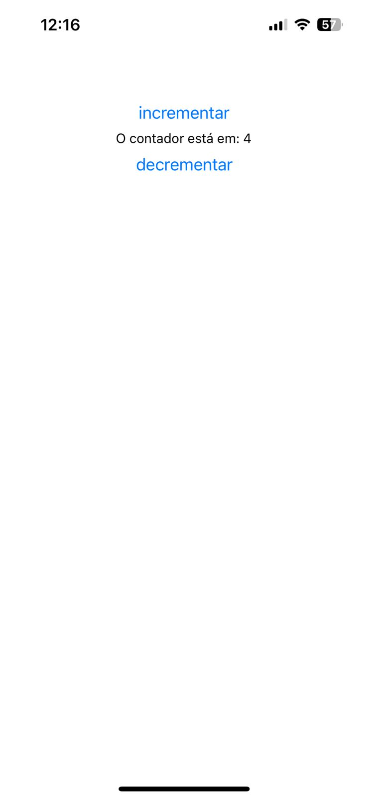
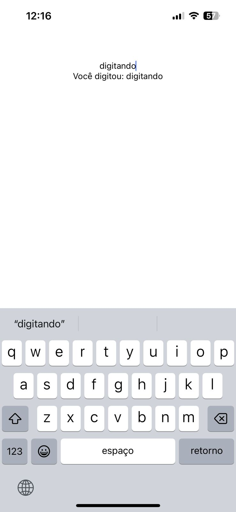
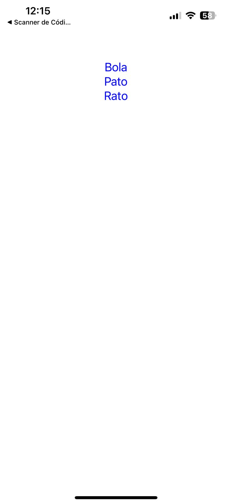
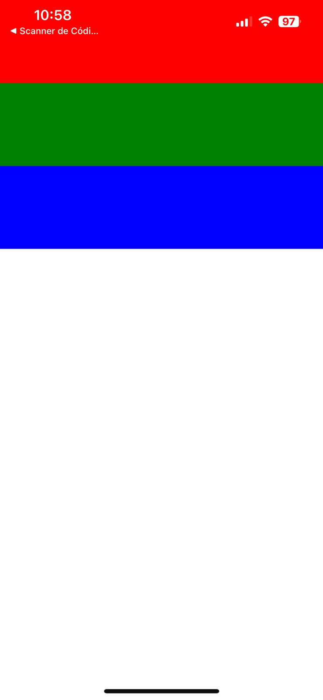
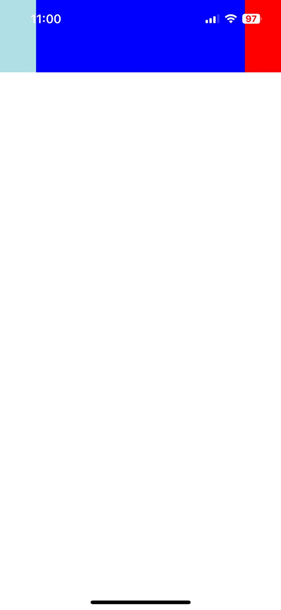
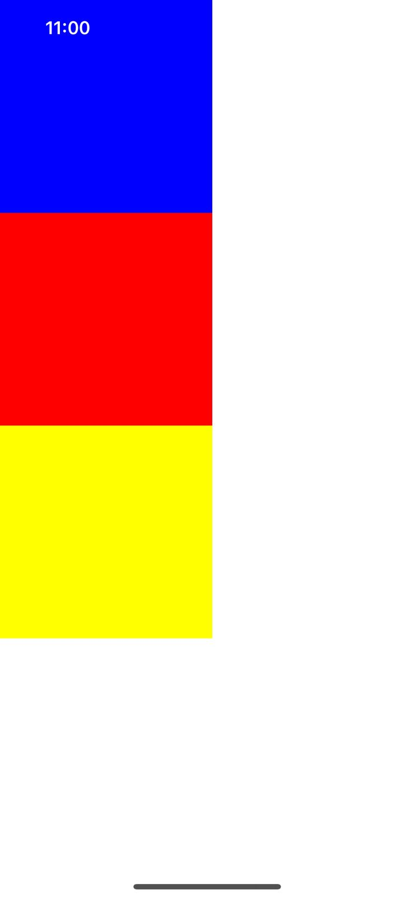
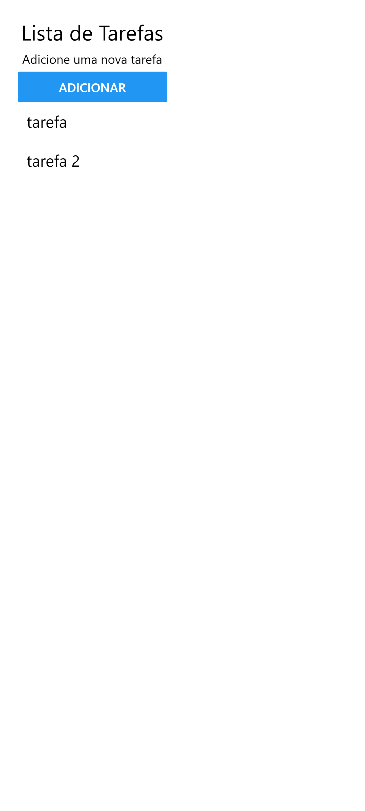

# 📱 Programação de Dispositivos Móveis - React Native

Este repositório contém os exercícios desenvolvidos durante a disciplina de **Programação de Dispositivos Móveis** utilizando a biblioteca **React Native**.

## 🚀 Tecnologias Utilizadas

- ⚛️ **React Native**: Framework para o desenvolvimento de aplicativos móveis multiplataforma.
- 💻 **JavaScript**: Linguagem de programação utilizada no desenvolvimento.
- 🛠️ **Expo**: Plataforma que facilita o desenvolvimento e a compilação de projetos React Native.
- 🖥️ **Visual Studio Code**: Editor de código recomendado para desenvolvimento.

## 🎉 Resultados

### Exercicio 01 - Aula 01

### Exercicio 02 - Aula 01

### Exercicio 03 - Aula 01

### Exercicio 04 - Aula 01

### Exercicio 01 - Aula 02

### Exercicio 02 - Aula 02

### Exercicio 03 - Aula 02

### Exercicio 04 - Aula 02

### Exercicio 05 - Aula 02

